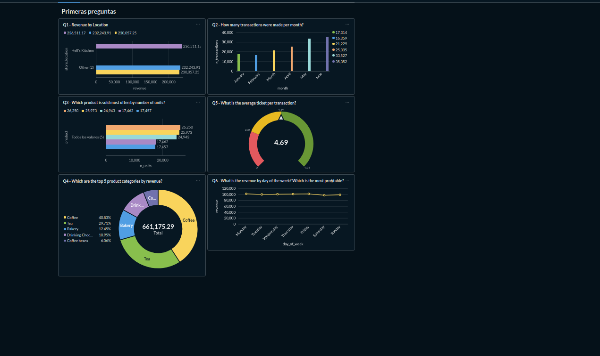
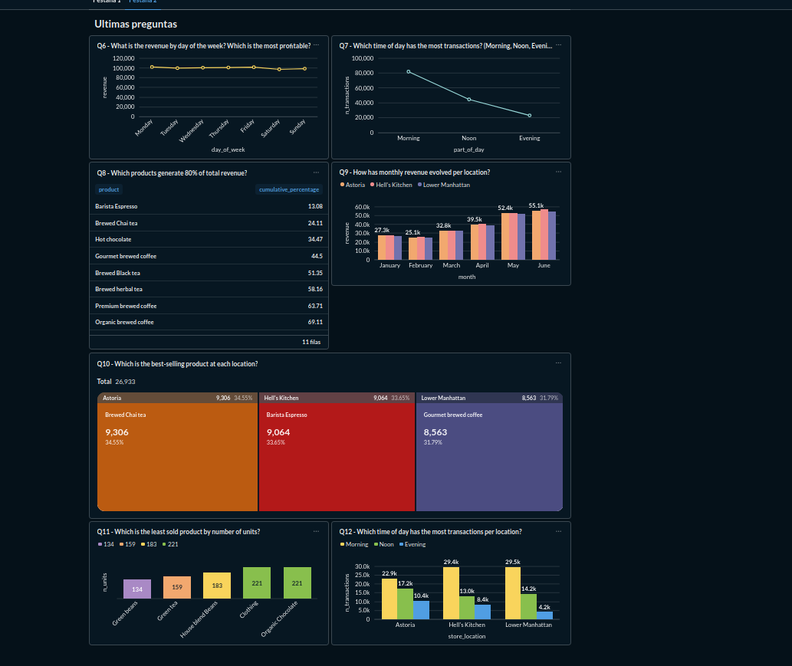

# Coffee Shop Sales — End-to-End Sales Analysis

> [Leer en Español](README_ES.md)

## Overview

End-to-end sales analysis of Maven Roasters, a fictitious coffee shop chain operating across three locations in New York City: **Astoria**, **Hell's Kitchen** and **Lower Manhattan**.

The dataset contains **149,116 transactions** covering January to June 2023, sourced from [Maven Analytics](https://mavenanalytics.io/data-playground).

The goal of this project is to identify sales trends, peak hours, top-performing products and revenue distribution across locations — and to communicate those findings through SQL, interactive dashboards and data storytelling.

---

## Tech Stack

| Tool | Purpose |
|---|---|
| PostgreSQL | Data cleaning and analysis |
| Google Sheets | Exploratory analysis and report |
| Metabase | Interactive dashboard |
| Google Slides | Data storytelling presentation |

---

## Project Structure

```
Coffee-Shop-Sales/
├── Coffee_shop_sales.sql        # Cleaning and analysis queries
├── Coffee Shop Sales Clean.csv  # Cleaned dataset
├── Coffee Shop Sales Report.ods # Google Sheets report
├── Coffee Shop Sales Slides.odp # Google Slides presentation
├── images/                      # Dashboard screenshots
│   ├── Pestaña1.png
│   └── Pestaña2.png
└── README.md
```

---

## Data Cleaning

The raw dataset required the following transformations in PostgreSQL:

- Converted `transaction_date` from text to `DATE`
- Converted `transaction_time` from text to `TIME`
- Replaced comma with period in `unit_price` and cast to `NUMERIC`
- Verified no null values or duplicate transaction IDs

---

## Business Questions Answered

| # | Question | Level |
|---|---|---|
| Q1 | What is the total revenue by location? | Easy |
| Q2 | How many transactions were made per month? | Easy |
| Q3 | Which product is sold most often by number of units? | Easy |
| Q4 | Which are the top 5 product categories by revenue? | Easy |
| Q5 | What is the average ticket per transaction? | Easy |
| Q6 | What is the revenue by day of the week? | Mid |
| Q7 | Which time of day has the most transactions? | Mid |
| Q8 | Which products generate 80% of total revenue? (Pareto) | Mid |
| Q9 | How has monthly revenue evolved per location? | Mid |
| Q10 | Which is the best-selling product at each location? | Mid |
| Q11 | Which is the least sold product by number of units? | Easy |
| Q12 | Which time of day has the most transactions per location? | Mid |

---

## Key Findings

- Revenue nearly doubled from January to June, with a consistent upward trend across all three locations
- Coffee and Tea together account for over 66% of total revenue
- Morning concentrates more than 54% of all transactions across all locations
- Hell's Kitchen leads in total revenue, but the three locations perform remarkably similarly
- Only 11 product types generate 80% of total revenue (Pareto rule)
- Monday is the most profitable day of the week; the weekend shows a notable drop

---

## Dashboard — Metabase

### Questions 1–6


### Questions 7–12


---

## Report and Presentation

- [Google Sheets Report](https://docs.google.com/spreadsheets/d/1W2Ymm32uv6lSEWj0O0o7zkh4Oi4On7DM7OHcs4_ywWc/edit?usp=sharing)
- [Google Slides Presentation](https://docs.google.com/presentation/d/1ELpaUJOFnoP_i7sV1CcAc2Yf_czP2mTgajzw8D95ut0/edit?usp=sharing)

---

## Business Conclusions

- Reinforce the Coffee and Tea offering as they represent 66% of total revenue
- Run marketing campaigns in January and February to compensate for the seasonal drop
- Concentrate staffing resources during the morning shift, especially Monday through Wednesday
- Review low-rotation products such as Green Beans to evaluate whether they should remain in the catalogue
- The three locations perform very similarly, indicating balanced management across the chain

---

## Possible Improvements

- Incorporate cost data to calculate profit margin by product and location
- Extend the analysis to a full year to detect real seasonality patterns
- Set up automatic alerts in Metabase when daily revenue drops below a defined threshold
- Segment the analysis by customer type if the dataset allowed it
- Automate dashboard updates with real-time data

---

## Use Cases

- A coffee shop owner can use this analysis to decide which products to promote or remove from the catalogue
- An operations manager can optimize staff shifts based on peak transaction hours
- A marketing team can design campaigns targeting the weakest months such as January and February
- Any food and beverage business with sales data can replicate this same analysis workflow

---

## Project Value

- Demonstrates a complete data analyst workflow: from data loading and cleaning to communicating results
- Combines SQL, visualization and storytelling — the three core competencies of a data analyst profile
- The SQL code is documented and reusable for similar datasets
- The Google Slides presentation demonstrates the ability to communicate findings to non-technical audiences

---

## Video Walkthrough

[](https://youtu.be/S72EymqK9dc)
